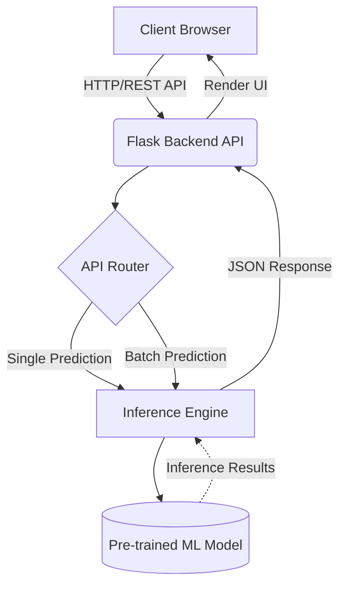
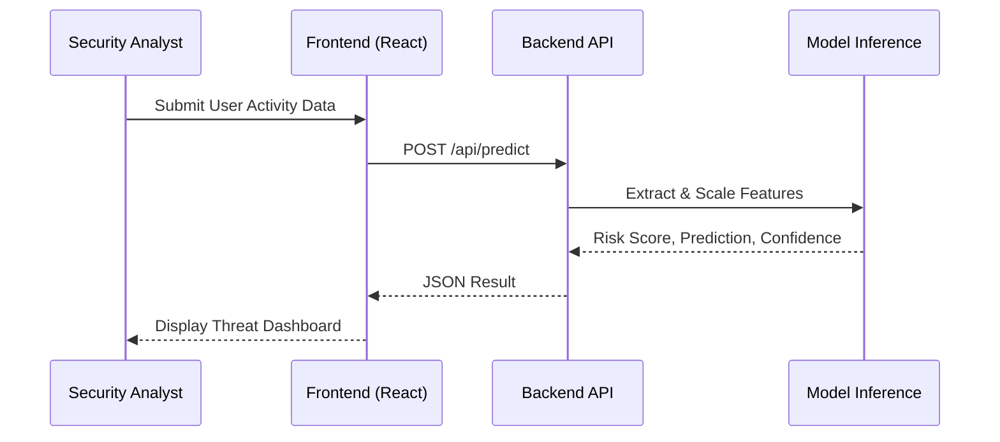

# 🛡️ ThreatGuard AI: Enterprise Insider Threat Detection Platform

[](https://opensource.org/licenses/MIT)
[](https://www.python.org/downloads/)
[](https://reactjs.org/)
[](https://vitejs.dev/)

> **An advanced, AI-powered cybersecurity dashboard for detecting, analyzing, and mitigating insider threats within corporate networks.**

---

## 📖 Short Description
ThreatGuard AI is an enterprise-grade SaaS application designed to monitor employee behavior and identify potential insider threats. Leveraging machine learning, the platform analyzes user activity logs to detect anomalous behavior, calculate risk scores, and present actionable insights through a modern, responsive security dashboard. 

---

## 🛑 Problem Statement
Insider threats—whether malicious employees, compromised credentials, or accidental data leaks—pose one of the highest risks to corporate network security. Traditional rule-based security systems often fail to detect subtle behavioral anomalies. ThreatGuard AI solves this by applying machine learning to analyze complex behavioral patterns, providing security teams with real-time risk assessments and high-confidence predictions to prevent data breaches before they occur.

---

## ✨ Key Features
- **Real-Time Security Dashboard:** A highly responsive, premium UI offering a command-center view of organizational security posture.
- **AI-Powered Threat Detection:** Evaluates employee activity using a robust machine learning model to classify behavior as `Normal` or `Insider Threat`.
- **Explainable AI (XAI):** Provides deep insights into prediction confidence, risk scores (0-100), and top contributing risk factors.
- **Batch Processing:** Allows bulk upload of CSV activity logs for massive parallel threat analysis.
- **Advanced Analytics & Timelines:** Visualizes threat trends, risk distribution, and historical data.
- **Enterprise UI/UX:** Built with a glassmorphism design, dark mode, and fluid animations comparable to top-tier enterprise tools (Microsoft Sentinel, CrowdStrike).

---

## 💻 Tech Stack

### Frontend
- **React.js (Vite)** - Fast, modern UI framework
- **Tailwind CSS v4** - Utility-first styling for responsive layouts
- **Framer Motion** - Fluid micro-animations
- **React Router** - Client-side routing
- **Recharts** - Data visualization and analytics charts
- **Lucide React** - Clean, modern iconography

### Backend
- **Flask** - Lightweight, highly scalable Python API
- **Flask-CORS** - Cross-Origin Resource Sharing handling

### Machine Learning
- **Scikit-learn** - Core machine learning library
- **Pandas & NumPy** - High-performance data manipulation
- **Joblib** - Model serialization and loading

---

## 🏗️ System Architecture



---

## 📂 Project Folder Structure

```text
Insider-Threat-Detection/
│
├── backend/
│   ├── app.py                 # Flask application & API endpoints
│   ├── utils.py               # Helper functions & preprocessing
│   ├── requirements.txt       # Python dependencies
│   └── models/
│       └── best_random_forest.pkl # Pre-trained ML model (Inference only)
│
├── frontend/
│   ├── public/                # Static assets
│   ├── src/
│   │   ├── components/        # Reusable React components (Navbar, Cards)
│   │   ├── pages/             # Route pages (Dashboard, Predict, Analytics)
│   │   ├── services/          # API integration logic
│   │   ├── App.jsx            # Application root & Router
│   │   └── index.css          # Tailwind & Global styles
│   ├── package.json           # Node dependencies
│   └── vite.config.js         # Vite configuration
│
└── README.md                  # Project documentation
```

---

## 🚀 Installation Guide

### Prerequisites
- Node.js (v18+)
- Python (3.10+)
- Git

Clone the repository:
```bash
git clone https://github.com/AnkitGit-prog/Insider-Threat-Detection.git
cd Insider-Threat-Detection
```

### 1. Backend Setup
Navigate to the backend directory and set up the Python environment:
```bash
cd backend
python -m venv venv

# Activate Virtual Environment
# Windows:
venv\Scripts\activate
# macOS/Linux:
source venv/bin/activate

# Install dependencies
pip install -r requirements.txt
```

> **Note:** You must place the pre-trained model file (`best_random_forest.pkl`) inside the `backend/models/` directory before running the server.

### 2. Frontend Setup
Open a new terminal window, navigate to the frontend directory, and install dependencies:
```bash
cd frontend
npm install
```

---

## 🔐 Environment Variables
Create a `.env` file in the `frontend` directory based on this example:

**.env.example**
```env
# API Configuration
VITE_API_URL=http://localhost:5000
```

---

## 🏃‍♂️ How to Run the Project

1. **Start the Backend API:**
   Ensure your virtual environment is active, then run:
   ```bash
   cd backend
   python app.py
   ```
   *The Flask server will start on `http://localhost:5000`*

2. **Start the Frontend Application:**
   ```bash
   cd frontend
   npm run dev
   ```
   *The React application will start on `http://localhost:5173`*

3. Open your browser and navigate to `http://localhost:5173` to view the platform.

---

## 📸 Screenshots

*Below are placeholder sections for project screenshots.*

<details>
<summary><b>1. Enterprise Security Dashboard</b></summary>
<br>
<p align="center">
  
</p>
</details>

<details>
<summary><b>2. Real-time Threat Prediction</b></summary>
<br>
<p align="center">
  
</p>
</details>

<details>
<summary><b>3. ML Pipeline Analytics</b></summary>
<br>
<p align="center">
  
</p>
</details>

---

## 🔌 API Endpoints

| Method | Endpoint | Description | Payload |
|--------|----------|-------------|---------|
| `GET`  | `/api/health` | Check backend & model status | None |
| `POST` | `/api/predict` | Single user behavioral prediction | JSON (User Features) |
| `POST` | `/api/batch-predict`| Bulk prediction via CSV upload | Multipart Form Data (.csv) |
| `GET`  | `/api/analytics` | Retrieve global threat statistics | None |

---

## 🧠 Machine Learning Overview
The application uses a pre-trained **Random Forest** model for inference. The model analyzes 39 engineered behavioral features to classify user activity profiles. 
*Note: This repository only contains the inference pipeline. Model training code, hyperparameter tuning, and raw experimental data are kept private for security and academic integrity.*

---

## 📊 Dataset Overview
The model was originally trained and validated using the **CERT Insider Threat Dataset** (v4.2 / v6.2), a comprehensive synthetic dataset developed by the CMU Software Engineering Institute. It contains realistic logs of user activity (logons, file transfers, HTTP traffic, emails, and device usage) interspersed with synthetic insider threat scenarios.

---

## 🔄 Project Workflow Diagram



---

## 🚀 Future Improvements
- **Integration with SIEM tools** (Splunk, QRadar) via Webhooks.
- **Active Directory (AD) integration** for live user fetching.
- **Automated Mitigation Responses** (e.g., auto-locking high-risk accounts).
- **Time-Series Deep Learning** models (LSTM/Transformers) for sequential log analysis.

---

## 📄 License
This project is licensed under the MIT License - see the [LICENSE](LICENSE) file for details.

---

## 👨‍💻 Author
**Ankit** 
- GitHub: [@AnkitGit-prog](https://github.com/AnkitGit-prog)

---

## 📫 Contact
For business inquiries, project discussions, or academic questions, please reach out via my GitHub profile.

---

## 🙏 Acknowledgements
- [CERT Division (CMU SEI)](https://sei.cmu.edu/) for their pioneering research in insider threat modeling.
- The open-source community for excellent libraries like React, Flask, and Scikit-learn.
